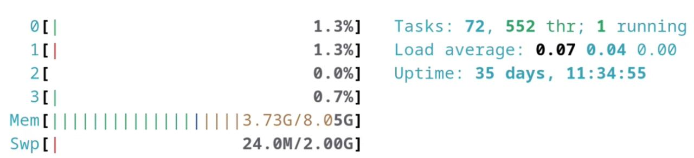
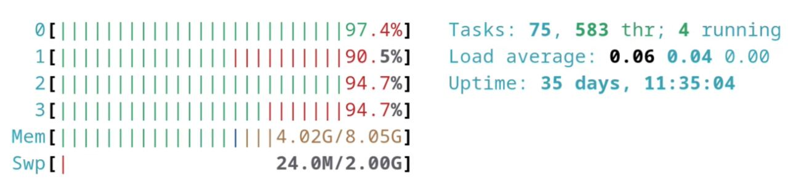

### Разместить на HDFS файл размером ~1Gb
Командой `sudo truncate -s 1G /home/hadoop/hw2/bigfile` создаём файл размером 1 gb

### Какие ресурсы (CPU, RAM, DISK) потребовала эта операция (на NN, на DN)?
в спокойном состоянии:


в момент добавления файла:


Потребление CPU доходит до 90%, потребление RAM до ~ 250МБ

### Как изменился файл образа ФС?
до - [fsimage1.txt](fsimage1.txt)

после - [fsimage2.txt](fsimage2.txt)

Появился файл который мы добавили - bigfile. Так же указан фактор репликации, Количество занимаемых блоков, создатель, last access time, в общем всё то же самое что и в обычной ФС
### Как изменился журнал изменений?
изначально там был только RECORD --> OP_START_LOG_SEGMENT.

После добавления большого файла появилось большое количество повторяющихся комбинаций OP_ADD_BLOCK, OP_ALLOCATE_BLOCK_ID и OP_SET_GENSTAMP_V2 с возрастающим RECORD --> DATA --> TXID

Так же заметно что DATA --> BLOCK --> NUM_BYTES у OP_ADD_BLOCK равно 134217728, что в точности равно 128 МБ

В конце edits2.xml записи OP_CLOSE и OP_RENAME_OLD

до добавления - [edits1.xml](edits1.xml)

после добавления - [edits2.xml](edits2.xml)
### Разместить на HDFS 1000 файлов общим размером ~1Gb
bash-скрипт:
```
for i in {1..1000}\
do\
sudo -u hadoop /usr/local/hadoop/bin/hdfs dfs -Ddfs.replication=3 -put /home/hadoop/hw2/file$i /smallfiles\
done
```
### Какие ресурсы (CPU, RAM, DISK) потребовала эта операция (на NN, на DN)?
в момент добавления файла:


Сам скрипт выполнялся почти пол часа, в целом нагрузка держится на протяжении всех получасов такая же как показана на скриншоте  

### Как изменился файл образа ФС?
до - [fsimage2.txt](fsimage2.txt)

после - [fsimage3.txt](fsimage3.txt)

Появились файлы который мы добавили, а так же папка в которой они были
### Как изменился журнал изменений?
Почти то же самое, но с другими файлами

до добавления - [edits2.xml](edits2.xml)

после добавления - [edits3.xml](edits3.xml), и после того как файл достиг критической массы, логи начали записываться в следующий файл - [edits4.xml](edits4.xml)